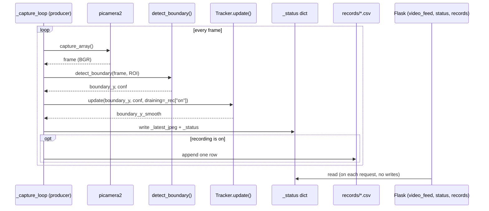

# CLAUDE.md

This file provides guidance to Claude Code (claude.ai/code) when working with code in this repository.

Automated water–cyclohexane liquid-liquid extraction system: a camera plus classical computer vision locates the
interface between two liquid phases (both colorless), then drives a pump to withdraw the lower layer to a target
point. Runs entirely on a single Raspberry Pi 5. Adapted from Chem-SDI (Fu et al., *Microchemical Journal* 227,
2026), with deep learning and bespoke hardware removed.

Full documentation: [`PRD.md`](docs/PRD.md) (requirements + pass/fail gates) · [`README.md`](README.md) (code layout) ·
[`BACKLOG.md`](docs/BACKLOG.md) (Agile backlog by phase, each item with a short ID) · [`ROADMAP.md`](docs/ROADMAP.md)
(roadmap -> milestones -> sprints -> stories -> sprint backlog, all as tables) · [`PROCESS.md`](docs/PROCESS.md)
(development workflow: Agile, Spec-Driven Development, Test-Driven Development) · [`CHANGELOG.md`](CHANGELOG.md)
(dated, verified history) · research-plan flow diagram (separate artifact).

---

## Hardware

| Component | Spec | Notes |
|---|---|---|
| Raspberry Pi 5 | Single board, does both vision and control | `ssh somdui@<pi-ip>` — IP changes with network (has been 192.168.100.242, 172.20.10.3) |
| Camera | Camera Module 3 (imx708 sensor) via `picamera2` | Manual exposure/AWB (auto disabled) — values are specific to the lighting on site |
| Vessel | **Cylindrical beaker** (switched from a pear-shaped separatory funnel) | Phases are separated via a pump intake tube resting at the bottom — no stopcock · a cylinder makes V = πr²h linear |
| Pump | MINTLLAB DP-DIY, 12V, 5W (~0.42A) | **Not wired yet** — must go through an isolated 12V supply + relay |

---

## Running things

```bash
# On the Pi — live stream + web page (http://<pi-ip>:5000)
cd ~/extractlab
nohup ./run_stream.sh > run_stream.log 2>&1 &     # supervisor: relaunches itself if the camera stalls
#   to stop for good: kill <pid of run_stream.sh>  or  pkill -f run_stream

# Tune camera/ROI without touching code — env vars:
EXPOSURE_US=25000 GAIN=8 WB_RED=2.14 WB_BLUE=1.76 \
ROI_X=555 ROI_Y=370 ROI_W=175 ROI_H=290 python3 realtime_stream.py

# Tests
python3 -m pytest -q                       # unit — tests/test_tracking.py (S1-S6), test_volume_model.py
python3 -m pytest tests/test_tracking.py   # "run a single test file"
python3 -m pytest -k s4                    # "run a single test"
python3 demo.py            # integration smoke test — must print RESULT: PASS
python3 turbidity_dct.py   # modules without pytest coverage yet have a __main__ self-check
python3 volume_model.py
python3 synthetic_data.py
# no lint/build step · boundary_detection.py is exercised through demo.py

# Analyze one real photo
python3 analyze_real_photo.py photo.jpg --roi X Y W H --profile-csv prof.csv

# Record a run while draining: click the record button on the web page -> records/rec_*.csv
#   or from another machine: python3 track_log.py drain.csv
```

`picamera2` comes from apt, not pip: `sudo apt install -y python3-picamera2` · a venv needs `--system-site-packages`

---

## File layout

| File | Role |
|---|---|
| `boundary_detection.py` | Finds `boundary_y` + `conf` from a row-wise intensity gradient — pure numpy/OpenCV array math, no camera I/O |
| `tracking.py` | `Tracker` — filters `boundary_y` over time (median + jump-reject + a `draining` gate) · hardware-free · owns `CONFIDENCE_THRESHOLD` + `TRACK_*` · has pytest coverage |
| `turbidity_dct.py` | `dct_sharpness()` + `TurbidityMonitor` — decides warming_up / turbid / clearing / clear |
| `volume_model.py` | `FrustumModel` + `CalibrationTable` (interpolate / JSON / inverse) — the geometry is still a placeholder |
| `synthetic_data.py` | Generates fake frames/draining sequences to test against before real data existed |
| `demo.py` | Wires the four modules above together, runs them against synthetic data + assertions (smoke test) |
| `analyze_real_photo.py` | CLI: boundary + sharpness against a single image, `--roi`, `--calib`, `--profile-csv` |
| `realtime_stream.py` | MJPEG stream + status panel + `/status` `/records` `/record/start|stop` endpoints · `Tracker` filters `boundary_y_smooth` · watchdog against a stalled camera |
| `run_stream.sh` | Supervisor: relaunches `realtime_stream.py` every time it exits (pairs with the watchdog) |
| `track_log.py` | Polls `/status` -> CSV from another machine |
| `records/` | CSV output from drain-test runs (one row per frame) |

---

## Architecture — runtime data flow

The code splits into two clearly separate worlds:

**1. Hardware-free analysis modules** — `boundary_detection`, `turbidity_dct`, `volume_model`.
Pure functions/classes that take numpy arrays (no camera I/O, no `picamera2`/`flask` imports).
`demo.py` wires all three together and runs them against frames from `synthetic_data.py` — the algorithm can be
fully tested on any machine. The detection chain in `boundary_detection.py`: crop the ROI -> per-row mean
brightness -> smooth -> `np.gradient` -> `argmax(|grad|)` (with an edge margin) -> that row is the interface,
`|grad|` there is `conf`.

**2. The live system `realtime_stream.py`** (needs a Pi + camera) — shaped as **a single producer thread with
several Flask-threaded consumers**:
- The `_capture_loop` thread is the single producer: `capture_array()` -> `detect_boundary(frame, ROI)` ->
  `tracking.Tracker.update(raw, conf, draining=_rec["on"])` -> writes `_latest_jpeg` + the `_status` dict + (while
  recording) one CSV row. **`draining=True` while recording -> the Tracker never re-seeds** (during a drain the
  interface moves slowly, so a large jump always means a false lock · replay of `rec_20260904_115249.csv`: max
  jump 151 -> 12 px).
- Flask only serves: `/video_feed` streams `_latest_jpeg`, `/status` returns `_status` plus recording state,
  `/records` + `/record/start|stop` manage files under `records/`.
- The `_watchdog` thread: if no new frame for 15s -> `os._exit(1)`, then `run_stream.sh` (the outer loop)
  relaunches it -> a stalled camera recovers on its own.
- **All configuration lives as module-level constants in `realtime_stream.py`**; most are overridable by env var
  (`ROI_X/Y/W/H`, `EXPOSURE_US`, `GAIN`, `WB_RED/BLUE`). `CONFIDENCE_THRESHOLD` and the `Tracker` parameters
  (`TRACK_*`, in `tracking.py`) are constants — the knobs that Phase 1's work (making the smoothed value stable)
  is currently tuning.

One frame cycle, producer side, matches this prose exactly:



The `_status` dict is the contract between the two halves: the capture loop is the only writer, `/status` (and
`track_log.py`, the web page) are readers.

---

## Design decisions (vs. the paper)

| Topic | Paper | What we use | Why |
|---|---|---|---|
| Finding the liquid region | YOLOv8n-seg | Hand-cropped ROI | The research question is "is classical enough?" — bringing ML back in makes it meaningless |
| Help seeing the interface | — | None (try the direct approach first) | Prove the signal is strong enough with real data before adding anything |
| Height -> volume | Frustum | Real calibration — a cylindrical beaker is linear | A cylinder needs no multi-point fit |
| Phase separation | Stopcock + stepper motor | Pump draws through a tube at the vessel bottom + relay | Use what's on hand |
| Compute | Orange Pi + STM32 | Single Pi 5 + GPIO + relay | Less hardware (risk: timing jitter untested) |

Kept from the paper: DCT turbidity monitoring and row-wise gradient boundary detection (both purely classical).

---

## Status (as of 4 Sep 2026, confirmed current 8 Oct 2026)

- **P0 done** — core modules + tooling complete, git + pushed to GitHub (`Cherrpxp/extractlab`)
- **P1 in progress** — black background + tight ROI -> the detector locks onto the real water/oil interface
  (`conf` ~12 vs. a threshold of 3). First real drain test, 219s: the trend was correct (moved 104 px) · the
  `Tracker` was fixed to never re-seed during a drain -> replaying the same data: max jump 151 -> 12 px, jumps
  over 20px: 14 -> 0. **Still need a fresh live drain run to formally confirm the gate.** A second finding since
  then: tested against a real separatory funnel (not the beaker), the detector locked onto a metal stopcock
  instead of the real interface — the classical row-gradient detector has no notion of "interface," it just
  picks the strongest edge in the ROI, and a tight ROI alone is a fragile fix. See `PRD.md` §5, risk 1, and
  `BACKLOG.md` epic P1 for the two candidate next steps (narrow the ROI further vs. build a motion-differencing
  detector that ignores color entirely).
- **P2–P7 not started** (calibrate volume -> wire the pump -> closed loop -> RMSE over 10 runs -> cyclohexane ->
  report).

---

## Known gotchas (read before touching)

- **`git push` from the Pi's terminal doesn't work** — no credential (`could not read Username`) · push via the
  Sync button in VS Code instead.
- **The camera's CSI cable is fragile** — handling/moving the camera a lot causes it to drop out intermittently
  (`Camera frontend has timed out`) · the sensor enumerates fine but delivers no frames = a cable or connector
  issue · the camera needs to be mounted rigidly with strain relief · a watchdog + `run_stream.sh` already
  recover at the software level, which treats the symptom, not the cause.
- **`picamera2`'s `"RGB888"` format already returns a BGR array** — do not call
  `cvtColor(..., RGB2BGR)` on top of it (this once turned the yellow organic layer blue).
- **`FrameDurationLimits` must be set wide**, or the pipeline silently clamps `ExposureTime` to ~33 ms.
- **Camera settings (exposure/gain/WB) are specific to the lighting where they were tuned** — moving the rig or
  changing the lights requires recalibrating (run AWB+AE in auto, read the values back, bake them in as manual
  again).
- **Calibration (ROI, mm/px, threshold, the volume table) is tied to the exact setup it was measured on** — it
  breaks the moment the camera or vessel moves.
- **Never wire the pump into the Pi's GPIO / 5V / GND pins** — 12V/0.42A vs. GPIO's safe ~16 mA · this has
  happened once already · `vcgencmd get_throttled` currently reads 0x0 (board is healthy).
- **A VPN on the machine viewing the web page** can block access to the Pi on the same LAN — disable it first if
  the page won't load.
- `pkill -f realtime_stream` from the terminal will kill its own shell if that same command line contains the
  string `realtime_stream` — kill by PID, or run it as a separate command.
