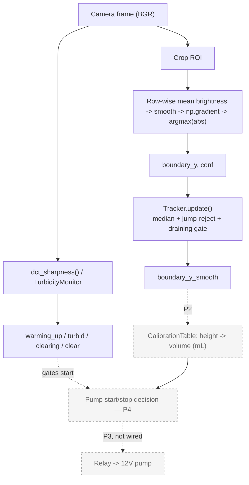

# extractlab — Automated Water–Cyclohexane LLE

Detects the interface between two liquid phases (both colorless) with a camera, then drives a pump to separate
them automatically. Uses **classical computer vision only** — no model training.

Adapted from **Chem-SDI** (Fu et al., *Microchemical Journal* 227, 2026), with the deep-learning and bespoke-
hardware parts removed, keeping DCT turbidity monitoring and row-wise gradient boundary detection.

Full requirements and reasoning: [`PRD.md`](docs/PRD.md) · working context for development: [`CLAUDE.md`](CLAUDE.md) ·
Agile backlog: [`BACKLOG.md`](docs/BACKLOG.md) · development process (Agile/SDD/TDD): [`PROCESS.md`](docs/PROCESS.md) ·
dated, verified history: [`CHANGELOG.md`](CHANGELOG.md) · research-plan flow diagram (separate artifact).

```
extractlab/
├── README.md, CLAUDE.md        # repo-root docs (GitHub / Claude Code conventions)
├── CHANGELOG.md                # dated, verified history — see docs/BACKLOG.md for item IDs
├── docs/                       # PRD.md, BACKLOG.md, PROCESS.md
├── boundary_detection.py       # core algorithms — flat, no build step, run directly
├── tracking.py
├── turbidity_dct.py
├── volume_model.py
├── synthetic_data.py
├── demo.py                     # integration smoke test
├── analyze_real_photo.py       # CLI tools
├── track_log.py
├── realtime_stream.py          # the live system (needs a Pi + camera)
├── run_stream.sh               # supervisor for realtime_stream.py
├── tests/                      # pytest suite
├── records/                    # CSV output from drain tests
└── requirements.txt
```

---

## How it works

Gray/dashed = not built yet — see `docs/BACKLOG.md` for the phase ID on each pending step.



`boundary_detection.py` + `turbidity_dct.py` run off the same frame in parallel; `tracking.py` is the only part
that remembers anything across frames. See `CLAUDE.md` for the full producer/consumer thread diagram around this.

---

## Status at a glance

**Current phase: P1** (detect & track the interface) — see [`CHANGELOG.md`](CHANGELOG.md) for the dated,
verified history behind this table and [`BACKLOG.md`](docs/BACKLOG.md) for the open items (`P1-07`-`P1-09`).

| Done | In progress | Not started |
|---|---|---|
| Core algorithms: `boundary_detection`, `turbidity_dct`, `volume_model`, `synthetic_data`, `demo` (`RESULT: PASS`) | Deciding how to handle the detector locking onto clutter instead of the interface in less-constrained scenes | Calibrating height -> volume with real measurements |
| `tracking.py` — temporal filter, unit-tested (`tests/`), validated by replaying a real drain recording | Re-running a live drain to formally confirm the P1 gate | Wiring the pump safely (12V + relay) |
| `realtime_stream.py` — live view, status panel, in-browser recording, CSV browser, self-healing watchdog | | Closed-loop control, a 10-run RMSE study, switching to real cyclohexane, the final report |

The detector reliably locks the real water/oil interface in a tightly-cropped, dark-background setup
(`conf` ~12 vs. a threshold of 3). It has **not yet** been confirmed live with the current tracker fix, and it
is known to lock onto clutter (e.g. a stopcock) instead of the interface in a less-constrained scene — see
`PRD.md` §5, risk 1, and `BACKLOG.md` epic P1 for the candidate fixes under consideration.

---

## Hardware

| Component | Spec | Notes |
|---|---|---|
| Raspberry Pi 5 | Single-board compute, vision + control | `ssh somdui@<pi-ip>` — IP varies by network |
| Camera | Camera Module 3 (imx708) via `picamera2` | Manual exposure/AWB tuned on site |
| Vessel | Cylindrical beaker (switched from a pear-shaped separatory funnel) | Separated via a pump intake tube at the bottom, no stopcock |
| Pump | MINTLLAB DP-DIY, 12V, 5W (~0.42A) | **Not wired yet** |

### Pump safety

**Never wire the pump directly into the Pi's GPIO / 5V / GND pins.** The pump draws 12V/0.42A; GPIO safely
supplies at most ~16 mA. This has been done by mistake once already (`vcgencmd get_throttled` currently reads
`0x0` — the board appears unharmed).

**The correct wiring (not yet built):** an isolated 12V supply -> a relay module (5V logic) -> the pump, with
GPIO only switching the relay.

### Network

The Pi lives on the dorm Wi-Fi. If SSH or the web stream won't connect, **disable any VPN on the viewing
machine first** — a VPN client blocks access to other devices on the same LAN.

---

## Setup

Runs on a Raspberry Pi 5. `picamera2` and `pytest` come from apt, not pip:

```bash
sudo apt install -y python3-picamera2 python3-pytest
python3 -m venv --system-site-packages .venv    # so the venv can see picamera2
source .venv/bin/activate
pip install -r requirements.txt                  # flask, opencv-python-headless, numpy
```

`boundary_detection.py`, `tracking.py`, `turbidity_dct.py`, `volume_model.py`, and `synthetic_data.py` only need
`numpy`/`opencv` — they run, and can be tested, on any machine, camera or no camera.

---

## Code layout

| File | Role |
|---|---|
| `boundary_detection.py` | Finds the interface row from a row-wise pixel gradient — pure numpy/OpenCV, no camera I/O |
| `tracking.py` | `Tracker` — temporal filter for the detected row (median + jump-reject + a `draining` gate); unit-tested |
| `turbidity_dct.py` | `dct_sharpness()` (image sharpness from high-frequency DCT energy) + `TurbidityMonitor`, which tracks warming_up / turbid / clearing / clear across frames with a sliding-window slope |
| `volume_model.py` | `FrustumModel` (placeholder geometry) + `CalibrationTable` (interpolated from real height-volume measurements, JSON save/load, with the inverse `height_mm(volume)` used to compute the pump's stop point) |
| `synthetic_data.py` | Generates fake frames/draining sequences (a descending interface, an emulsion slowly clearing) to test the pipeline before real data exists |
| `demo.py` | Wires the four modules above together, runs them on a synthetic draining sequence, prints a per-frame table and an RMSE summary — doubles as a smoke test |
| `analyze_real_photo.py` | CLI that runs boundary detection + `dct_sharpness` on one real photo (`--roi`), writes an annotated image + `--profile-csv` for threshold tuning, and `--calib` to convert to volume |
| `realtime_stream.py` | Live MJPEG stream + status panel at `http://<pi-ip>:5000` (needs `picamera2` + a camera); in-browser recording to `records/`; a watchdog that recovers from a stalled camera |
| `run_stream.sh` | Supervisor that relaunches `realtime_stream.py` whenever it exits |
| `track_log.py` | Polls `/status` from another machine and writes a CSV |
| `tests/` | `pytest` suite — `test_tracking.py` (temporal-filter spec, clauses S1-S6) and `test_volume_model.py` |
| `records/` | CSV output from drain-test runs, one row per frame |
| `requirements.txt` | Dependencies and the picamera2 install note |

Every script runs stand-alone (`python3 demo.py`, `python3 turbidity_dct.py`, ...) for a synthetic-data
self-check, and `python3 -m pytest -q` runs the full unit suite. See `CLAUDE.md` for the full architecture and
the list of known gotchas, and `PROCESS.md` for how new work gets specified and tested before it's built.

---

## Usage

### Live stream on the Pi

```bash
./run_stream.sh                 # or: nohup ./run_stream.sh > run_stream.log 2>&1 &
# open http://<pi-ip>:5000
```

Camera/ROI/threshold tuning is done through environment variables, not by editing the file — see `CLAUDE.md`
"Running things".

### Calling the detector from code

```python
import cv2
from boundary_detection import detect_boundary

frame = cv2.imread("vial.jpg")                       # BGR
boundary_y, confidence = detect_boundary(frame, roi=(560, 80, 160, 560))
# boundary_y = vertical pixel coordinate in the full frame, confidence = |gradient| at that row
```

### Testing the pipeline and analyzing a real photo

```bash
python3 -m pytest -q                                  # unit tests
python3 demo.py                                       # full synthetic dry run, must print RESULT: PASS
python3 analyze_real_photo.py photo.jpg --roi 610 235 110 150 --profile-csv prof.csv
```

---

## Known risks

See `PRD.md` §5 for the full, reasoned risk list. In short:

1. **The classical detector's signal-to-clutter ratio** — it locks onto whichever edge in the ROI has the
   strongest gradient, not "the interface" specifically; confirmed to lock onto a stopcock instead of a real
   water/oil interface in a less-constrained scene.
2. **A single Pi 5 does both vision and control** — timing jitter during pump control is untested.
3. **The calibration table is tied to the exact vessel and camera position measured** — it breaks if either
   moves.
4. **The pump is not wired yet** — see the safety section above.

---

## References

Fu, X. et al. "Chem-SDI: Segmentation, detection, and inference model for AI robotic chemists in
automated liquid-liquid extraction workflow." *Microchemical Journal* 227 (2026): 118844.
