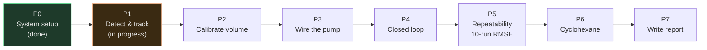

# 01 — Roadmap

Derived from `PRD.md` §4 (Success Metrics) and §6 (Current Status). One row per phase; each phase is an epic
in `BACKLOG.md` with its own gate — nothing here is invented, it's `PRD.md`'s plan laid out as a table.

| Phase | Goal | Gate (PRD §4) | Status |
|---|---|---|---|
| P0 | System & algorithm setup | `demo.py` -> `RESULT: PASS` | **Done** |
| P1 | Detect & track the interface on real liquids | `boundary_y_smooth` monotonic during a drain, no jump > 30 px, interface found in >= 95% of frames | **In progress — one item left (`P1-08`)** |
| P2 | Calibrate height -> volume | Predicted-volume RMSE < 2 mL | Not started |
| P3 | Wire the pump safely | Wiring reviewed, starts/stops on command, flow rate measured | Not started |
| P4 | Closed loop (detect -> decide -> pump -> stop) | Clean separation, pump stops within target | Not started |
| P5 | Repeatability study | RMSE < 2 mL across 10 runs, no run off by > 5 mL | Not started |
| P6 | Switch to real water-cyclohexane | RMSE comparable to water/oil (within 50%) | Not started |
| P7 | Write the report | — | Not started |

See `02_milestones.md` for these phases grouped into checkpoints, `03_sprints.md` for how work on them has
actually been paced, `04_stories.md` for every backlog item, and `05_sprint_backlog.md` for what's active right
now. Full reasoning behind each gate: `../PRD.md` §4.
