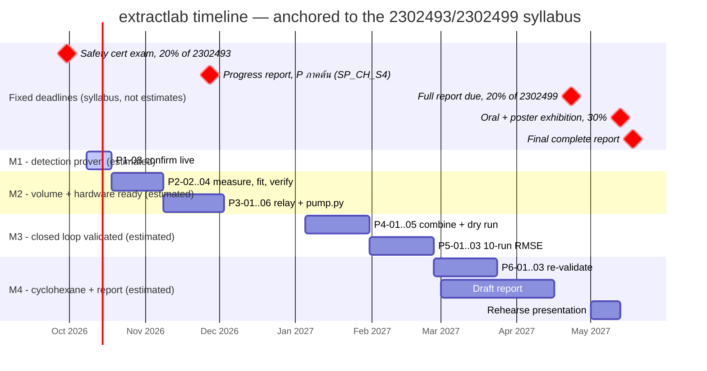

# 02 — Milestones

The 8 phases in `01_roadmap.md` grouped into 4 checkpoints, each answering one specific question the thesis
needs answered. The Gantt chart's five `crit` markers are **real deadlines** from the department syllabus
(`2302493/499`, academic year 2569/2026) — not estimates; the phase bars around them are a proposed pace.

| Milestone | Phases | Answers | Done when | Status |
|---|---|---|---|---|
| **M1 — Detection proven** | P0, P1 | Can a classical (non-ML) pipeline find and track the interface reliably? | P1 gate closed (`P1-08`) | In progress — P0 done, P1's only remaining item is `P1-08` |
| **M2 — Volume + hardware ready** | P2, P3 | Can height convert to volume, and can the pump be driven safely? | P2 and P3 gates both closed | Not started |
| **M3 — Closed loop validated** | P4, P5 | Does the whole system work unattended, repeatably? | P5 gate closed (10-run RMSE) | Not started |
| **M4 — Cyclohexane + report** | P6, P7 | Does it hold up on the real target pair, and is it written up? | P6 gate closed, report submitted | Not started |

This lands M1 (detection proven) well before the 27 Nov progress-report checkpoint, and M4 (cyclohexane +
report draft) before the 23 Apr full-report deadline, with slack before the 13 May presentation. Only the five
`crit` dates are commitments — adjust the phase bars freely as the actual pace becomes clearer.
