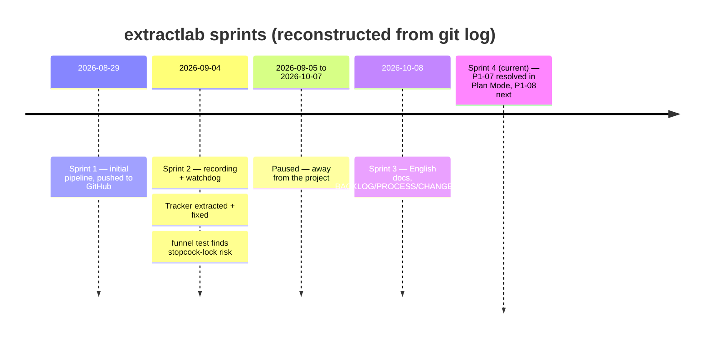

# 03 — Sprints

Reconstructed from `git log`, not planned in advance on a fixed calendar — this is a solo project with irregular
availability (a month-long gap is visible below), so a sprint here means "one dated unit of work," not a fixed
weekly cadence.

| Sprint | Dates | Scope (story IDs) | Outcome |
|---|---|---|---|
| Sprint 1 | 2026-08-29 | `P0-01`, `P0-02`, `P0-03`, `P0-07` | Initial pipeline committed, pushed to GitHub |
| Sprint 2 | 2026-09-04 | `P0-04`, `P0-05`, `P0-06`, `P1-01`-`P1-06` | Recording + watchdog shipped; `Tracker` extracted and fixed (replay 151 -> 12 px); real-funnel test found the stopcock-lock risk |
| *(paused)* | 2026-09-05 - 2026-10-07 | — | Away from the project |
| Sprint 3 | 2026-10-08 | docs translation, `BACKLOG.md`/`PROCESS.md`/`CHANGELOG.md`, architecture + logic diagrams | Full English documentation trail established |
| **Sprint 4 (current)** | 2026-10-08 - | `P1-08` | Resolved `P1-07` in Plan Mode by re-reading the hardware table (beaker has no stopcock, the finding was funnel-specific, retired equipment) — no new detector needed; the only remaining P1 work is confirming the gate live |

Sprint 2's single day covers more than it looks like it should — most of P0's remaining items and most of P1
landed in one long session; `CHANGELOG.md` has the dated, per-item breakdown if the granularity here isn't
enough.
