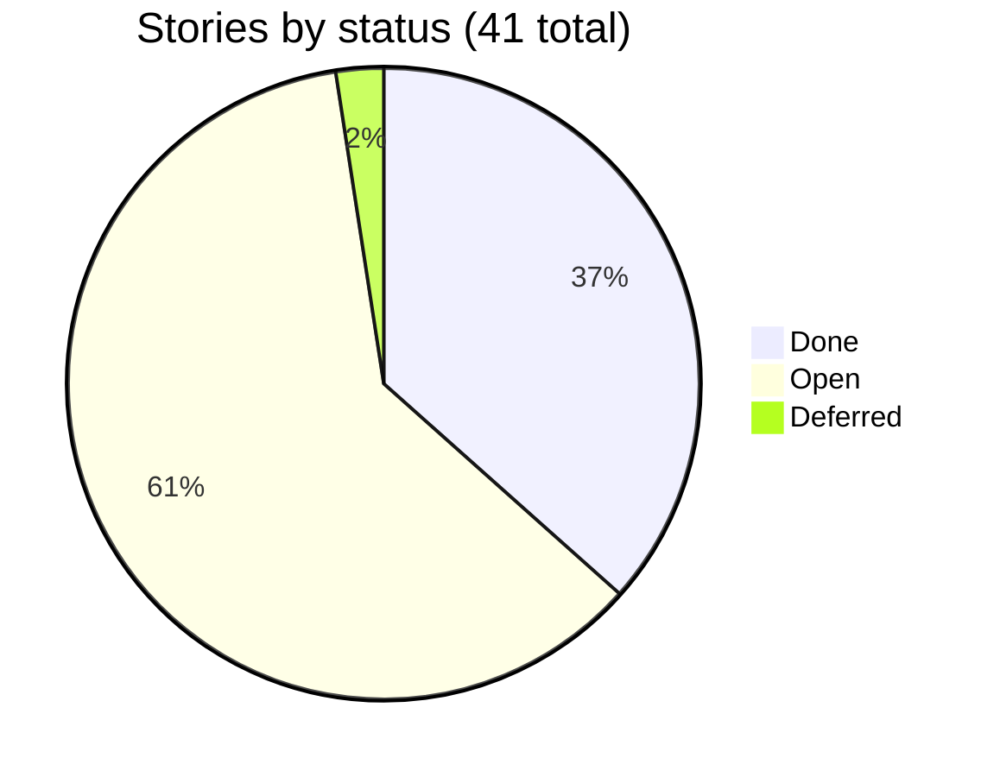

# 04 — Stories

Every backlog item, one row each, condensed from `BACKLOG.md` — full reasoning for any row lives there, under
the matching epic.

| ID | Phase | Status | Story |
|---|---|---|---|
| P0-01 | P0 | Done | Camera exposure/WB tuned on the Pi; fixed a BGR/RGB swap + the `FrameDurationLimits` clamp |
| P0-02 | P0 | Done | Core modules pass against synthetic data (`demo.py` -> `RESULT: PASS`) |
| P0-03 | P0 | Done | `realtime_stream.py` — live view + status panel + `/status` |
| P0-04 | P0 | Done | In-browser recording + a CSV browse page |
| P0-05 | P0 | Done | `boundary_y_smooth` — median-of-9 + jump rejection |
| P0-06 | P0 | Done | Watchdog + `run_stream.sh` supervisor |
| P0-07 | P0 | Done | Pushed to GitHub (`Cherrpxp/extractlab`) |
| P1-01 | P1 | Done | Black background + a tight ROI locks the real interface (`conf` ~12 vs. threshold 3) |
| P1-02 | P1 | Done | First live drain test, 219s, recorded + analyzed |
| P1-03 | P1 | Done | Extracted `Tracker` into `tracking.py`, spec S1-S6, unit-tested |
| P1-04 | P1 | Done (reverted) | First fix hypothesis invalidated by replay (max jump 151 -> 194 px) |
| P1-05 | P1 | Done | Correct fix: never re-seed while draining (replay 151 -> 12 px, jumps>20px 14 -> 0) |
| P1-06 | P1 | Done | Found the detector locks onto a stopcock on a real funnel — that funnel is since retired for the beaker |
| P1-07 | P1 | Done | Resolved by the vessel switch: the beaker has no stopcock, no observed failure on it — no new detector needed |
| P1-08 | P1 | **Open** | Re-run a live drain to confirm the P1 gate formally — the only remaining P1 item |
| P1-09 | P1 | Deferred to P6 | If cyclohexane's weaker signal needs it: spec -> test (red) -> implement motion differencing |
| P2-01 | P2 | Done | `CalibrationTable` written + unit-tested |
| P2-02 | P2 | Open | Measure the beaker's diameter, mm/px scale, zero-volume row |
| P2-03 | P2 | Open | Fill to 2-3 known volumes, fit a line |
| P2-04 | P2 | Open | Verify against a held-out volume (target RMSE < 2 mL) |
| P3-01 | P3 | Open | Confirm `vcgencmd get_throttled` reads `0x0` before wiring |
| P3-02 | P3 | Open | Source a 12V supply + a 5V-logic relay module |
| P3-03 | P3 | Open | Wire 12V -> relay -> pump (never through Pi GPIO/5V/GND) |
| P3-04 | P3 | Open | Test relay switching from GPIO with no liquid |
| P3-05 | P3 | Open | Measure the pump's flow rate (mL/s) |
| P3-06 | P3 | Open | Write `pump.py` (`start`/`stop`/`flow_rate`/`run_volume`/`purge`) |
| P4-01 | P4 | Open | Combine detection -> volume -> pump start/stop |
| P4-02 | P4 | Open | Gate pump start on turbidity |
| P4-03 | P4 | Open | Safety timeout + emergency-stop condition |
| P4-04 | P4 | Open | Check vision-loop timing holds with the pump running |
| P4-05 | P4 | Open | Dry run with water + oil |
| P5-01 | P5 | Open | Run the full loop 10x |
| P5-02 | P5 | Open | Record actual vs. predicted volume |
| P5-03 | P5 | Open | Report RMSE, mean error, standard deviation |
| P6-01 | P6 | Open | Re-run a shortened P1 with cyclohexane |
| P6-02 | P6 | Open | Re-run P2 if needed |
| P6-03 | P6 | Open | Repeat the 10-run study with cyclohexane |
| P7-01 | P7 | Open | Methods + results write-up |
| P7-02 | P7 | Open | Comparison against Chem-SDI |
| P7-03 | P7 | Open | Limitations + future work |
| P7-04 | P7 | Open | Disclose AI-assisted development |
