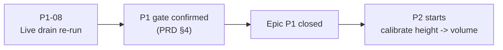

# 05 — Sprint Backlog (current — Sprint 4)

What's actually being worked on right now, nothing else.

| ID | Story | Status |
|---|---|---|
| P1-08 | Re-run a live drain on the beaker to confirm the P1 gate formally | **Next — the only remaining item in epic P1** |

`P1-07` closed itself out during planning (in Plan Mode, per the advisor's instruction): the stopcock-lock
finding was specific to the retired separatory funnel, and the beaker (the apparatus actually in use) has no
stopcock and no recorded failure. No new detector code was needed — see `../BACKLOG.md` epic P1 for the full
reasoning. `P1-09` (motion differencing) is deferred to P6, conditional on cyclohexane actually needing it.

This file gets replaced wholesale at the start of each sprint, not accumulated — history lives in
`03_sprints.md` and `../CHANGELOG.md`, not here.
